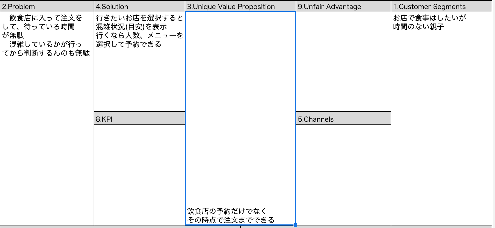

  アイデア出し
指定したお店の予約ができる
会員登録で注文もできる
注文した料理は予約時間にはできているようにする
混雑状況がわかる
近くの地域のお店がわかる
店をお気に入り登録できる

  ペルソナ
30歳女性
結婚しており４歳の子どもがいる
夫婦共働きであり、自炊はあまりできていない
そのためよくスーパーの総菜や、お弁当を利用する
いつも同じだと飽きがくるため、お店に行くことも多い。
しかし夫婦のどちらかの帰りが遅くなると、子供を寝かせる時間を
確保しにくくなるので、お店には行きにくい
そこで、speedishで時間短縮を考える。

  エレベーターピッチ
時間がない、あるいはお店の中に長時間いるのを躊躇してしまう方が、
席が空くまでの待ち時間、注文を決める時間、注文を待っている時間
を短縮できるように、
お店に入る前に注文を決めてしまえて着いたらすぐに料理が運ばれてくる
というシステム

  ユーザーストーリーマッピング
ユーザーは(地域を指定して)近くのお店を検索できる
ユーザーはお店を選択するとメニュー一覧が見れる
ユーザーはそのお店に予約ができる
会員登録すると注文までできる
会員登録するとお店のお気に入り機能も使える

  MVP
検索機能
会員登録、ログイン機能
予約注文機能
